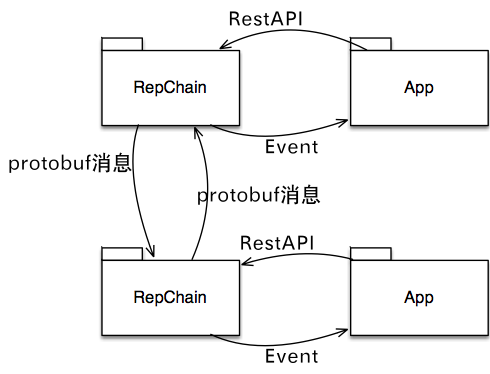
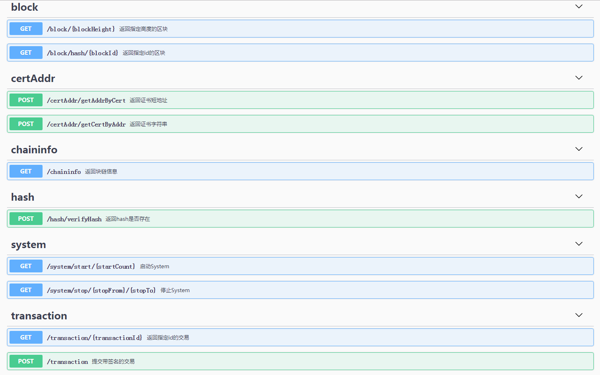
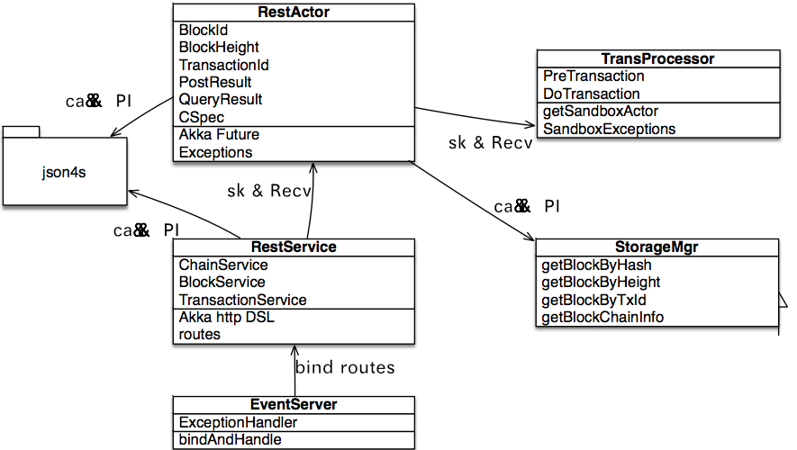
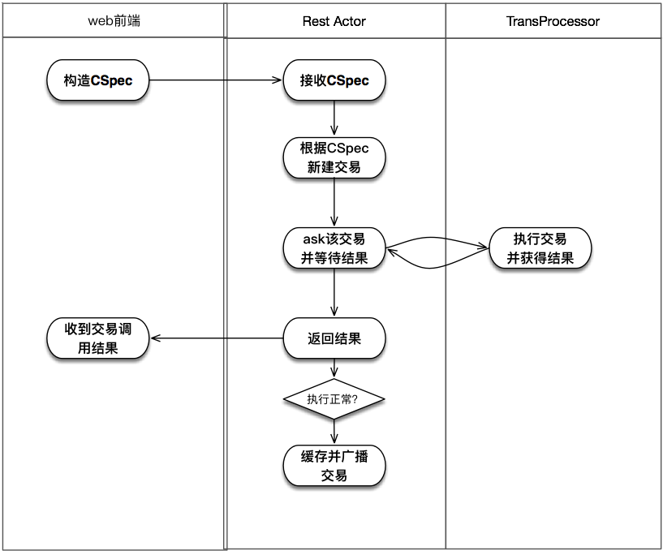
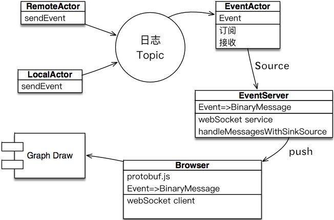

##1.1 类型

外部接口包括三类：

* repChain各个节点之间的接口

	repChain作为去中心化的分布式网络，各网络节点之间通过消息相互作用。
	
* repChain为第三方应用提供的restful API
* repChain为第三方应用提供的Event事件流

三类接口交互示意图如下：

##1.2 消息交互

消息交互在repChain网络节点之间进行，消息格式采用protobuf定义，以protobuf序列化字节流的形态，在akka Cluster中传播。

消息的传播形式既可以是Sub／Pub，也可以是P2P。目前的实现采用Sub/Pub。

##1.3 Restful API

系统提供restful API供UI及第三方App调用，api文档以swagger UI方式提供online try。
   
   
   
API的实现采用akka http dsl的route机制，为了支持swagger-UI，引入swagger-akka-http。

为了支持对象的json序列化／反序列化，引入json4s。提交时json4s能够将web提交的json内容反序列化为传入参数对象，
返回结果时，json4s将结果对象转为json结构返回web端。Scalapb所生成的protobuf类支持json4s序列化。

Akka http的route分流不同url到相应的处理逻辑，它们采用一致的处理逻辑：将构造好的请求消息向RestActor ask，
并等待返回结果。RestActor负责处理所有的请求，以阻塞方式返回结果，或者抛出处理异常。

   

RestActor调用存储层的API，获得检索结果，然后通过json4s序列化返回web。

RestActor 向SandBox的调度actor——TransactionProcessor发送Ask请求并等待执行结果返回，如果执行正常，
它向负责广播的actor发送此交易。无论执行正常与否，它都会向RestService回送执行结果，并进一步回送给web。

   
   
##1.4 Event数据流

   
	   
* Event的源头是本地actor或者Remote actor，它们在系统运行中，将需要可视化的Event通过akka cluster的Sub／Pub，以Event主题广播到提供事件服务的EventActor。
* EventActor负责订阅Event Topic并接收Event消息，收到消息之后又封装为一个Source提供给EventServer。
* EventServer将消息序列化为akka http所支持的webSocket 字节流，其格式为通用的protobuf字节流。
* EventServer将Event的protobuf字节流push到浏览器。
* 浏览器通过webSocket client接收到推送的字节流之后，通过第三方的protobuf.js，可以将字节流反序列化为Event类，前提是事先将Event类的proto定义灌入protobuf.js。
* 反序列化获得Event对象之后，交付给负责绘制图形的模块，用以更新图形显示。