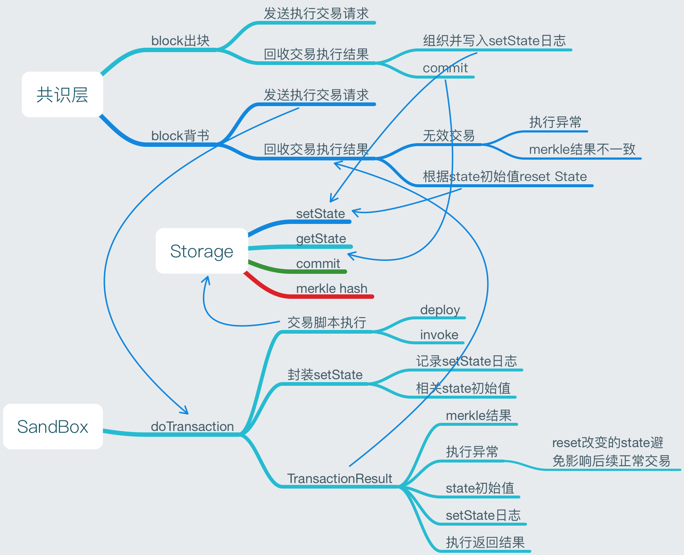

**交易执行交互示意图**

   
   

执行／预执行结果包含6项，说明如下

```
case class DoTransactionResult(t:Transaction,r:Any,merkle:Option[String],
	ol:List[Oper],
	mb:scala.collection.mutable.Map[Key,Any],
	err:Option[akka.actor.Status.Failure]
)
```
 
**t:** 传入的交易，回传以便调用方匹配结果对应的输入交易；

**r:** 交易中脚本执行结果，可以时任意类型；

**merkle:** 交易执行完毕的worldState merkle根；

**ol:** 交易执行过程中对worldState的set操作日志，用以将来增量同步worldState；

**mb:** 交易执行过程中修改的worldState名，以及执行之前的初始值，用以回滚worldState；

**err:** 执行中出现的异常，如果出现异常，sandbox会自行回滚worldState。
